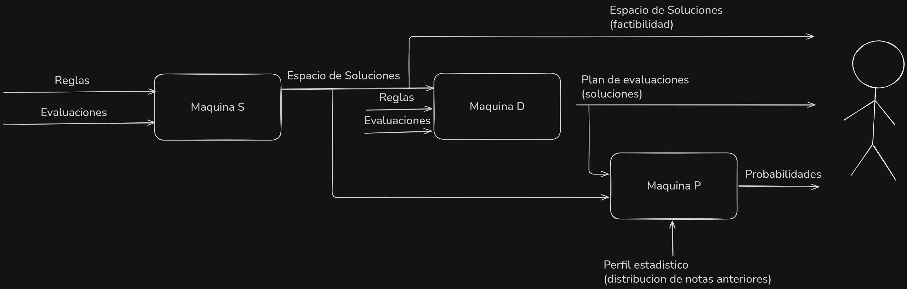

# GradeSolver

**GradeSolver** es un motor de análisis y planificación académica de alto rendimiento escrito en **C++20**.
Permite analizar la viabilidad de aprobar un curso, generar planes de acción con diferentes estrategias y calcular probabilidades de éxito basándose en restricciones complejas y datos históricos.

El sistema implementa tres máquinas de análisis que trabajan en conjunto:

1. **Máquina S (Espacio de Soluciones):** Calcula rangos de factibilidad para cada evaluación.
2. **Máquina D (Determinística):** Genera planes de acción con diferentes estrategias de distribución de esfuerzo.
3. **Máquina P (Probabilística):** Evalúa la viabilidad de cada plan mediante simulaciones Monte Carlo.

El proyecto incluye:
1. **Core Library:** Lógica de negocio pura implementando las tres máquinas.
2. **CLI:** Interfaz de línea de comandos con visualización de resultados.
3. **Bindings:** Librería compartida (`.so`) exportable a Python, Node.js, etc.

---

## Arquitectura del Sistema


### Máquina S - Sistema de Restricciones
Analiza las restricciones del sistema de calificación y determina:
- **Mínimo de supervivencia:** Nota mínima absoluta requerida para cada evaluación.
- **Mínimo de seguridad:** Nota mínima que garantiza cumplir todas las restricciones.
- **Máximo posible:** Nota máxima alcanzable considerando las evaluaciones ya rendidas.
- **Restricciones incumplibles:** Identifica si ya es imposible aprobar.

### Máquina D - Estrategias Determinísticas
Genera planes de acción con cuatro estrategias diferentes:
- **MINIMUM:** Minimiza el esfuerzo total requerido.
- **BALANCED:** Distribuye el esfuerzo equitativamente entre todas las evaluaciones pendientes.
- **MIN_WEIGHT_FIRST:** Prioriza evaluaciones de menor peso (bajo impacto en la nota final).
- **MAX_WEIGHT_FIRST:** Prioriza evaluaciones de mayor peso (alto impacto en la nota final).

Cada estrategia produce un plan con notas objetivo específicas para cada evaluación pendiente.

### Máquina P - Análisis Probabilístico
Evalúa cada plan generado por la Máquina D usando simulaciones Monte Carlo:
- **Probabilidad del plan:** Probabilidad de ejecutar exactamente ese plan específico.
- **Probabilidad general:** Probabilidad de aprobar con cualquier combinación de notas.
- **Viabilidad:** Ratio que indica qué tan factible es el plan (probabilidad_del_plan / probabilidad_general).

Las simulaciones se basan en el perfil estadístico histórico (media y desviación estándar) del estudiante.

---

## Requisitos Previos

### Para Compilar y Ejecutar el CLI (C++)
Necesitas un entorno de desarrollo C++ moderno:

* **Compilador C++20:** GCC 10+ o Clang 10+.
* **CMake:** Versión 3.15 o superior.
* **Make:** Para utilizar el wrapper de automatización.

> **Nota:** La dependencia `nlohmann/json` se descarga y configura automáticamente mediante CMake (`FetchContent`), no necesitas instalarla manualmente.

### Para Compilar los Bindings WASM (JavaScript/Node.js)
Si deseas compilar el binding WASM para usar desde JavaScript:

* **Emscripten SDK:** Requerido para compilar C++ a WebAssembly.
  - Instalación: https://emscripten.org/docs/getting_started/downloads.html
* **Node.js:** Versión 14.0.0 o superior para ejecutar los tests.

---

## Compilación

El proyecto incluye un `Makefile` para simplificar el flujo de trabajo.

1. **Compilar todo (Lib y CLI):**
   ```bash
   make
   ```
   *Esto generará la carpeta `build/`, configurará CMake y compilará los binarios.*

2. **Compilar el binding WASM:**
   ```bash
   make wasm
   ```
   *Genera `solver.js` y `solver.wasm` en `tests/js/`*

3. **Ejecutar tests del binding WASM:**
   ```bash
   make test-wasm
   ```

4. **Limpiar la compilación:**
   ```bash
   make clean          # Limpia build de C++
   make clean-wasm     # Limpia build de WASM
   ```

---

## Uso del CLI

Una vez compilado, puedes usar el ejecutable directamente con un archivo JSON de configuración.

**Comando:**
```bash
./build/cli/solver_cli <archivo_entrada.json>
```

Se puede usar la opción `--raw` para obtener una salida en JSON sin formato.
```bash
./build/cli/solver_cli <archivo_entrada.json> --raw
```

### Formato de Entrada

El archivo JSON debe seguir la siguiente estructura:

```json
{
    "contexto": {
        "nota_minima": 0.0,
        "nota_maxima": 100.0,
        "nota_aprobacion": 55.0
    },
    "S": {
        "evaluaciones": [
            {
                "id": "Certamen 1",
                "peso": 0.5,
                "valor_actual": null,
                "tags": ["certamen"]
            },
            {
                "id": "Certamen 2",
                "peso": 0.5,
                "valor_actual": null,
                "tags": ["certamen"]
            }
        ],
        "restricciones": [
            {
                "id": "Minimo por certamen",
                "tipo": "NOTA_MINIMA_INDIVIDUAL_TAG",
                "tag_objetivo": "certamen",
                "valor_minimo": 30.0
            }
        ]
    },
    "P": {
        "simulaciones": 1000,
        "media_historica": 65.0,
        "desviacion_estandar": 10.0
    }
}
```

**Componentes principales:**
- **contexto:** Define los límites del sistema de calificación y la nota de aprobación.
- **S.evaluaciones:** Lista de evaluaciones con su peso, valor actual (null si está pendiente) y etiquetas.
- **S.restricciones:** Reglas que deben cumplirse para aprobar.
- **P:** Parámetros para las simulaciones probabilísticas.

### Tipos de Restricciones

#### NOTA_MINIMA_INDIVIDUAL_TAG
Cada evaluación con el tag especificado debe cumplir un mínimo individual.

```json
{
  "id": "Minimo por certamen",
  "tipo": "NOTA_MINIMA_INDIVIDUAL_TAG",
  "tag_objetivo": "certamen",
  "valor_minimo": 30.0
}
```

#### PROMEDIO_SIMPLE_TAG
El promedio de todas las evaluaciones con el tag debe cumplir un mínimo.

```json
{
  "id": "Promedio de certamenes",
  "tipo": "PROMEDIO_SIMPLE_TAG",
  "tag_objetivo": "certamen",
  "valor_minimo": 40.0
}
```

### Salida del CLI

#### 1. Salida Raw JSON (`--raw`)
Devuelve el análisis completo en formato JSON para consumo programático:

```json
{
  "contexto": {
    "nota_aprobacion": 55.0,
    "nota_maxima": 100.0,
    "nota_minima": 0.0
  },
  "evaluaciones": [...],
  
  "maquina_s": {
    "es_posible": true,
    "rangos_por_evaluacion": {
      "Certamen 1": {
        "max_posible": 100.0,
        "min_seguridad": 55.0018310546875,
        "min_supervivencia": 30.0018310546875
      },
      "Certamen 2": {
        "max_posible": 100.0,
        "min_seguridad": 55.0018310546875,
        "min_supervivencia": 30.0018310546875
      }
    },
    "restricciones_incumplibles": []
  },
  
  "maquina_d": {
    "BALANCED": {
      "estrategia_aplicada": "BALANCED",
      "notas_objetivo": {
        "Certamen 1": 55.0,
        "Certamen 2": 55.0
      },
      "promedio_final_teorico": 55.0
    },
    "MINIMUM": {
      "estrategia_aplicada": "MINIMUM",
      "notas_objetivo": {
        "Certamen 1": 55.0018310546875,
        "Certamen 2": 55.0018310546875
      },
      "promedio_final_teorico": 55.0018310546875
    },
    "MAX_WEIGHT_FIRST": {
      "estrategia_aplicada": "MAX_WEIGHT_FIRST",
      "notas_objetivo": {
        "Certamen 1": 80.0018310546875,
        "Certamen 2": 30.0018310546875
      },
      "promedio_final_teorico": 55.0018310546875
    },
    "MIN_WEIGHT_FIRST": {
      "estrategia_aplicada": "MIN_WEIGHT_FIRST",
      "notas_objetivo": {
        "Certamen 1": 80.0018310546875,
        "Certamen 2": 30.0018310546875
      },
      "promedio_final_teorico": 55.0018310546875
    }
  },
  
  "maquina_p": {
    "BALANCED": {
      "probabilidad_del_plan": 0.716,
      "probabilidad_general": 0.917,
      "viabilidad": 0.7808069792802618
    },
    "MINIMUM": {
      "probabilidad_del_plan": 0.722,
      "probabilidad_general": 0.928,
      "viabilidad": 0.7780172413793104
    },
    "MAX_WEIGHT_FIRST": {
      "probabilidad_del_plan": 0.072,
      "probabilidad_general": 0.913,
      "viabilidad": 0.07886089813800658
    },
    "MIN_WEIGHT_FIRST": {
      "probabilidad_del_plan": 0.071,
      "probabilidad_general": 0.906,
      "viabilidad": 0.07836644591611479
    }
  },
  
  "perfil_usado": {
    "desviacion_estandar": 10.0,
    "media_historica": 65.0
  },
  "restricciones": [...]
}
```

**Interpretación de resultados:**

**Máquina S:**
- `es_posible: true` indica que sí es factible aprobar el curso.
- `rangos_por_evaluacion` muestra para cada evaluación pendiente:
  - `min_supervivencia`: Nota mínima absoluta requerida.
  - `min_seguridad`: Nota mínima recomendada para cumplir restricciones.
  - `max_posible`: Nota máxima alcanzable.

**Máquina D:**
- Cada estrategia propone un plan específico con notas objetivo.
- `promedio_final_teorico` muestra la nota final si se ejecuta ese plan.

**Máquina P:**
- `viabilidad` cercana a 1.0 indica un plan muy factible.
- `viabilidad` cercana a 0.0 indica un plan poco realista.
- En este ejemplo, BALANCED (0.78) y MINIMUM (0.78) son los planes más viables.
- MAX_WEIGHT_FIRST (0.08) es muy arriesgado: requiere 80 puntos en Certamen 1.

#### 2. Salida Formateada (por defecto)
*En desarrollo. Por ahora use `--raw` para obtener el análisis completo.*

---

## Casos de Uso

### Estudiante sin notas previas
Analiza diferentes estrategias para aprobar el curso y su viabilidad basada en tu rendimiento histórico.

**Ejemplo:** `./build/cli/solver_cli tests/cases/01-basic.json --raw`

### Estudiante con evaluaciones rendidas
Calcula qué necesitas en las evaluaciones pendientes considerando las notas que ya tienes.

**Ejemplo:** `./build/cli/solver_cli tests/cases/03-evaluado.json --raw`

### Análisis de múltiples restricciones
Evalúa escenarios complejos con restricciones de promedios por categoría y mínimos individuales.

**Ejemplo:** `./build/cli/solver_cli tests/cases/02-rules.json --raw`

---

## Ejemplos

El directorio `tests/cases/` contiene casos de prueba completos:

- `01-basic.json` - Caso simple con dos certámenes y restricción de nota mínima.
- `02-rules.json` - Múltiples tipos de restricciones (promedios y mínimos por tag).
- `03-evaluado.json` - Caso con evaluaciones ya rendidas y múltiples categorías.

---

## Schema de Validación

El proyecto incluye un JSON Schema (`schema.json`) que documenta y valida la estructura de entrada.

Para habilitar validación automática en tu editor, agrega al inicio de tu archivo JSON:

```json
{
  "$schema": "https://raw.githubusercontent.com/madmti/GradeSolver/master/schema.json",
  ...
}
```
